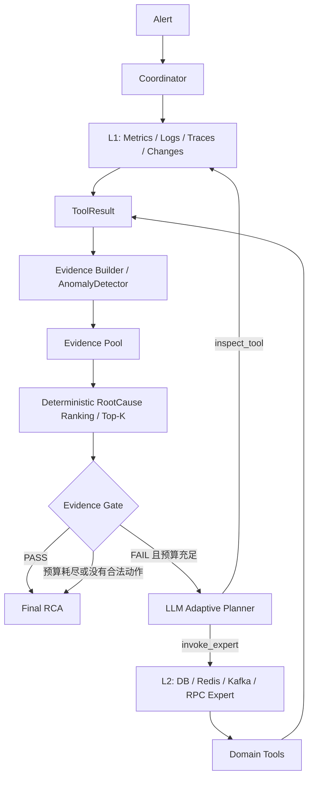
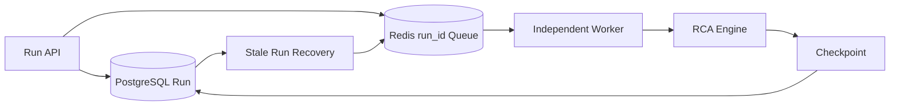

# OpsPilot

OpsPilot 是面向微服务故障诊断的自适应 Multi-Agent RCA 系统。项目分成两部分：RCA Engine 决定怎么诊断，异步 Runtime 保证诊断能够可靠执行和恢复。

## RCA Engine：怎么诊断


```mermaid
flowchart TD
    A[Alert] --> C[Coordinator]
    C --> L1[L1: Metrics / Logs / Traces / Changes]
    L1 --> T[ToolResult]
    T --> E[Evidence Builder / AnomalyDetector]
    E --> P[Evidence Pool]
    P --> R[Deterministic RootCause Ranking / Top-K]
    R --> G{Evidence Gate}
    G -->|PASS| F[Final RCA]
    G -->|FAIL 且预算充足| L[LLM Adaptive Planner]
    L -->|inspect_tool| L1
    L -->|invoke_expert| X[L2: DB / Redis / Kafka / RPC Expert]
    X --> D[Domain Tools]
    D --> T
    G -->|预算耗尽或没有合法动作| F
```

Coordinator 根据公开告警类型、严重程度和标签选择 2–3 个低成本通用工具作为首轮调查。L1 的广度调查指 Metrics、Logs、Traces、Changes；Topology 和相关告警查询是补充工具。L2 Expert 选择自己的领域工具，得到的 ToolResult 使用同一个 Evidence Builder。

L3 确定性分析包含历史基线对比、IQR 和滚动波动检测，输出直接进入 Evidence Pool。证据保留来源、置信度、支持/反驳的根因和原始观测引用；同一事实去重，同一 ToolResult 的多个检测结果只算一个独立来源。排名累加支持证据的 confidence、扣减反驳证据的 confidence，输出 Top-3。

Evidence Gate 检查 Top-1 不是 NO_FAULT、confidence、Top1/Top2 margin 和独立证据来源数。通过则停止；未通过则继续规划，直到轮数或工具预算耗尽，或者没有合法动作。Expert budget 单独限制领域调用，不会阻止普通工具补查。最终结果记录 stop_reason。

**设计边界：LLM 负责下一步查什么；确定性代码负责工具权限、Evidence、异常检测、Gate、预算和最终根因排名。** 可选 LLM 解释只针对已经确定的根因，不能修改候选排名。Planner 只能返回 `inspect_tool` 或 `invoke_expert`，且不能读取作为工具后端快照的 `alert.signals`。

### LLM 失败后的 fallback

1. Evidence 的 `supports` 明确指向一个未调用领域，且 Expert budget 充足：调用该 Expert。
2. 否则依次选择未执行的 Metrics、Logs、Traces、Changes、Topology、Alerts 工具。
3. 没有合法且未重复的动作：返回 None。

Fallback 不分析告警关键词、不根据 alert_type 猜领域，也不读取未观测的后端快照。它保证可靠退出，不能替代 LLM 的开放式调查能力。Expert 根据证据支持的根因选择对应领域工具；缺少细分线索时检查该领域的小型固定工具集。

## Runtime：怎么可靠执行


```mermaid
flowchart LR
    API[Run API] --> PG[(PostgreSQL Run)]
    API --> Q[(Redis run_id Queue)]
    Q --> W[Independent Worker]
    W --> RCA[RCA Engine]
    RCA --> CP[Checkpoint]
    CP --> PG
    PG --> REC[Stale Run Recovery]
    REC --> Q
```

PostgreSQL 是 Run、ToolExecution、Checkpoint、事件和报告的事实源；Redis 只传递 run_id。Worker 在 Action、Tool 和 Gate 边界保存状态，恢复扫描重新入队 stale Run，持久化 ToolCall 幂等键避免已成功工具重复执行。重试和超时仍由 Tool Executor 控制。

Runtime 不解释异常检测或领域证据。它给 `AdaptiveInvestigator` 注入工具执行函数和 checkpoint 回调，保存/恢复调查状态。在线执行和离线评测共用 Engine；`OpsPilotWorkflow` 仅作为离线工具执行包装，两种入口都调用 `investigation/report.py` 的唯一报告构造函数。

当前 checkpoint schema 为 **3.0**，graph version 为 `opspilot-runtime-v6-compact-report`；不转换旧 checkpoint，版本不匹配会明确失败。

## API 与 Report

| 方法 | 路径 | 用途 |
|---|---|---|
| POST | `/api/v1/runs` | 提交 request_id 与 Alert，返回 run_id |
| GET | `/api/v1/runs/{run_id}` | 查询状态 |
| GET | `/api/v1/runs/{run_id}/result` | 获取最终结果；运行中返回 202 |
| GET | `/api/v1/runs/{run_id}/events?after=0` | 按事件序号增量查询 |
| WS | `/api/v1/runs/{run_id}/stream` | 订阅调查事件 |

DiagnosisReport schema **2.0** 包含 trace_id（在线时等于 run_id）、告警与服务标识、Top-K、primary_root_cause、Evidence、decision_rationale、recommended_actions，以及耗时和降级信息。调查说明集中在嵌套的 `investigation: InvestigationTrace`，包括轮数、动作、Gate 判断、预算和停止原因。

工具调用 ID、attempt、latency、status、error_code 通过 `/events` 查询，不再平铺在最终报告中。旧报告中间结构和旧兼容接口已删除。

## 运行和验证

```bash
bash scripts/bootstrap_dev_env.sh
source .venv/bin/activate
ruff check src tests
pytest -q
```

未配置服务 URL 时，HTTP 冒烟测试运行本地测试应用，使用 SQLite 和内存队列；这不等同于真实 PostgreSQL/Redis 的独立进程验证。真实基础设施测试需要设置 `OPSPILOT_TEST_DATABASE_URL`、`OPSPILOT_TEST_REDIS_URL`。显式设置 `AGENT_URL` 和 `MOCK_URL` 时，冒烟客户端连接部署服务。

启动 API、Worker、PostgreSQL、Redis 与 Mock：

```bash
docker compose --profile full up --build -d
```

LLM 默认关闭。需要时设置 `OPSPILOT_LLM_ENABLED=true` 和 `DEEPSEEK_API_KEY`；模型、地址和超时使用 `OPSPILOT_LLM_MODEL`、`OPSPILOT_LLM_BASE_URL`、`OPSPILOT_LLM_TIMEOUT_SECONDS`。所有工具只读，报告提供处置建议，不自动修改生产资源。

API 示例与恢复验证见 [测试指南](tests/guide/full-flow-test-guide.md)。

## 评测范围与已知限制

v1 原始数据集保持不变，共 25 个 dev、12 个 frozen-test 样本。第二阶段对照关闭 LLM，结果如下：

| 模式 | dev 故障 Hit@1 | test 故障 Hit@1 |
|---|---:|---:|
| 第二阶段之前的关键词/default fallback | 21/21 | 10/10 |
| 当前 Evidence + 固定工具顺序 fallback | 6/21 | 2/10 |
| 当前固定执行全部工具，使用同一 Evidence + Ranker | 21/21 | 10/10 |

许多旧样本只有领域后端快照，没有 L1 领域线索。删掉语义 fallback 后，未启用 LLM 就不会猜测这些领域。**这是真实的调查覆盖率下降，不能用排名正确率代替完整自适应诊断准确率。** 当前未执行付费真实 LLM 评测；Planner 的成功、非法输出、异常和 fallback 边界由可控响应测试覆盖。

[逐样本对照](artifacts/reconstruction_2/comparison.json) 保留重构前结果、当前 fallback 与完整观测 Top-K。CI 分别检查完整观测的确定性排名、合法动作/预算和 Runtime 可靠性；自适应覆盖率原样报告，不再使用已经移除的语义 fallback 的全命中门槛。

```bash
python -m opspilot.evaluation.cli run --config benchmarks/configs/fixed_planner.yaml --split dev
python -m opspilot.evaluation.cli run --config benchmarks/configs/full_adaptive_rca.yaml --split dev
python -m opspilot.evaluation.cli run --config benchmarks/configs/full_adaptive_rca.yaml --split test
python -m opspilot.evaluation.cli concurrency --config benchmarks/configs/tool_concurrency.yaml
python -m opspilot.evaluation.cli reliability --config benchmarks/configs/runtime_faults.yaml
```

历史评测工件保留供追溯，不代表当前版本。`adaptive_planner` 和 `full_adaptive_rca` 两个历史配置名目前调用同一实现；`adaptive_without_dynamic_l2` 通过 Expert budget=0 禁用领域深挖。

## 代码入口

```text
src/opspilot/
├── agents/          # Coordinator、确定性 Ranker、可选结果解释
├── investigation/   # Engine、Planner、Gate、共享 Report 构造
├── evidence/        # ToolResult → Evidence
├── rca/             # Historical Baseline / IQR / Rolling Volatility
├── tools/           # Registry、Executor、通用与领域工具
├── tracing/         # Mock / Jaeger / OTLP 与异常 Span 路径
├── runtime/         # TaskManager、Queue、Worker、可恢复执行
├── persistence/     # PostgreSQL models / repositories
├── api/             # Runs、Events、WebSocket
├── graph/           # 薄离线包装，不维护另一套 RCA
└── evaluation/      # 数据集、对照评测、可靠性验证
src/deeprca/mock_env/ # 独立 Mock 服务；旧诊断实现已删除
```
