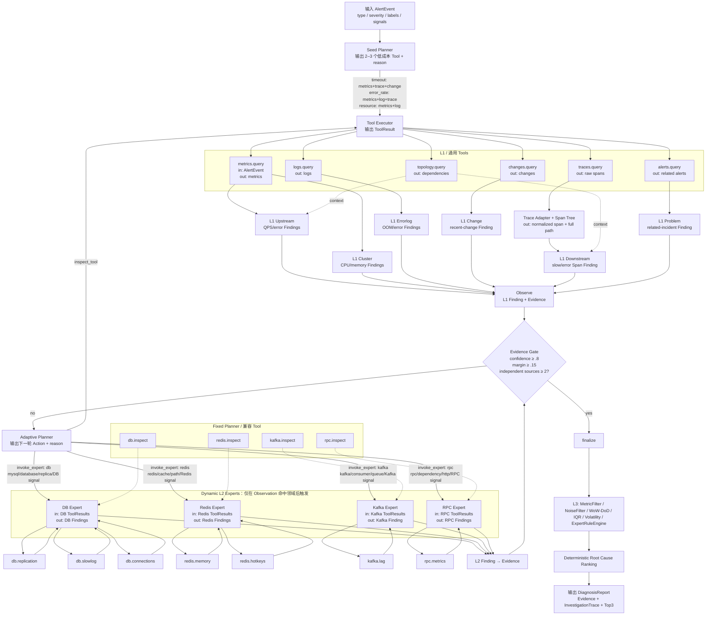

# OpsPilot Tool、L1 与 L2 调查链

本文描述 Runtime v3 的真实行为。Coordinator 只生成 2–3 个低成本 Seed Tool；Controller 分析本轮 Observation，经 Evidence Gate 判断是否足够，再从白名单中选择 `inspect_tool`、`invoke_expert` 或 `finalize`。所有 Tool 均接收 `AlertEvent`，统一返回 `ToolResult.data.observations`。

## Tool 清单

| Tool | 调用维度 / Expert | 触发条件 | 返回信息 | Observation → Finding / Evidence |
|---|---|---|---|---|
| `metrics.query` | L1 Upstream / Cluster | 所有类型的 Seed；`resource` 最高优先级 | QPS、error rate、TP99、CPU、memory 及时间序列 | QPS 下降 50% → `upstream_qps_drop`；error rate ≥ 5% → `upstream_error_rate`；CPU/内存 ≥ 85% → `{metric}_high` 与资源 Evidence |
| `logs.query` | L1 Errorlog | `error_rate/resource` Seed；P0 或证据不足时补查 | `logs/messages`、级别、服务、Trace ID | OOM 关键字 → `oom_signature` / `log.oom`；其他错误记录 → `error_pattern` |
| `changes.query` | L1 Change | `timeout/custom` Seed；release/config label 或证据不足时补查 | 发布、配置变更、风险数、时间 | 近期发布、变更非空或高风险数 ≥ 1 → `recent_change` / `change.recent_deployment` |
| `traces.query` | L1 Downstream | `timeout/error_rate` Seed；dependency/trace label 优先 | Mock、Jaeger 或 OTLP 原始 Span | Adapter 归一化后按 `parent_span_id` 重建树；错误状态或耗时 > 1000 ms → `downstream_span_error/slow`，保留根服务到异常服务的完整 path |
| `topology.query` | L1 Upstream / Downstream 上下文 | Seed 证据不足且 timeout/error_rate | 上下游服务和依赖关系 | 当前只补充依赖上下文，不单独产生 Finding |
| `alerts.query` | L1 Problem | P0/P1 且证据不足 | 关联告警、已知问题 | 任一非空 → `related_incident` |
| `db.inspect` | 固定方案 DB Expert | 仅 Fixed Planner 消融或兼容调用 | DB 连接、慢查询、复制延迟全集 | 与下列 DB 专用 Tool 使用相同阈值；Adaptive 主链不预先调用 |
| `redis.inspect` | 固定方案 Redis Expert | 仅 Fixed Planner 消融或兼容调用 | Redis 内存、命中率全集 | 与下列 Redis 专用 Tool 使用相同阈值 |
| `kafka.inspect` | 固定方案 Kafka Expert | 仅 Fixed Planner 消融或兼容调用 | Consumer Lag、吞吐全集 | lag ≥ 1000 → `kafka_consumer_lag` |
| `rpc.inspect` | 固定方案 RPC Expert | 仅 Fixed Planner 消融或兼容调用 | timeout/error rate、延迟、基线、调用量 | timeout ≥ 5% 或延迟比 ≥ 3 → `rpc_timeout`；error ≥ 5% → `rpc_error_rate` |
| `db.replication` | L2 DB Expert | L1 Trace/Finding 出现 mysql/database/replica，或 DB signal 可用；上下文含复制/read/mysql 时选择 | replication/slave lag | lag ≥ 5 s → `db_replication_lag`；≥ 15 s 为 critical；转成 `db.replication_lag` Evidence |
| `db.slowlog` | L2 DB Expert | DB Expert 已触发且上下文含 slow/latency/query/mysql | slow query 数与记录 | count ≥ 10 → `db_slow_query` / `db.slow_query` |
| `db.connections` | L2 DB Expert | DB Expert 已触发且上下文含 connection/queue/capacity/resource | active/max connections | 使用率 ≥ 80% → `db_connection_exhausted` / `db.connection_usage` |
| `redis.memory` | L2 Redis Expert | L1 path/文本出现 redis/cache，或 Redis signal 可用 | 内存使用率、used memory、eviction | 内存 ≥ 80% → `redis_memory_pressure` / `redis.memory_usage` |
| `redis.hotkeys` | L2 Redis Expert | Redis Expert 已触发 | 命中率、hotkeys | 命中率 ≤ 90% → `redis_low_hit_rate` / `redis.hit_rate` |
| `kafka.lag` | L2 Kafka Expert | L1/告警出现 kafka/consumer/queue/event delivery，或 Kafka signal 可用 | consumer/total lag、produce/consume rate | lag ≥ 1000 → `kafka_consumer_lag` / `kafka.consumer_lag` |
| `rpc.metrics` | L2 RPC Expert | L1/告警出现 rpc/grpc/dependency/downstream/http，或 RPC signal 可用 | timeout/error rate、延迟、基线、调用量 | timeout ≥ 5% 或延迟比 ≥ 3 → `rpc_timeout`；error ≥ 5% → `rpc_error_rate`，并生成同名 Evidence |

未达到阈值表示“观察正常”，不是 Tool 失败；结果仍是合法 `SemanticAnalysisResult(findings=[])`。失败 Tool 会进入 `missing_sources`，报告标记 `degraded=true`。

## 完整调用图

## 调查与恢复边界

- Action 只允许 `inspect_tool`、`invoke_expert`、`finalize`；Tool/Expert 必须存在于白名单。
- 默认上限为 4 轮、8 次 Tool、2 次 Expert；相同 Action identity 不重复执行。
- `InvestigationTrace` 保存每轮原因、Gate 判断、Tool/Expert 消耗与停止原因。
- Runtime v3 把同一调查状态写入 Checkpoint；Worker 恢复后会继续未完成 Action，已成功的稳定 `tool_call_id` 不会重复产生成功执行。
